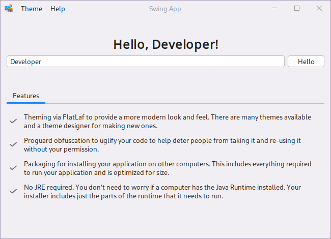

# Swing App Example

This example application demonstrates how Java Swing is a viable option for cross-platform desktop applications in 2022.

This project brings together several things in order to create a modern looking desktop application that can be
distributed. Installers it generates includes only the necessary files in order for the application to run on another
computer, which can be as small as 50mb. It doesn't require end-users install (or have installed) the Java runtime
and it doesn't include the full Java runtime.

This example application includes theming, obfuscation, packaging, and generating the installers. **The
[pom.xml](pom.xml) is the most important part since it brings all these things together.**

### Disclaimer

I'm new to Swing and still learning Java although my background is many years as a developer using other languages.
Things may not be implemented as cleanly or optimally as by someone more experienced with this tech.

### Notable Libraries Used

- Themes via FlatLaf ([GitHub](https://github.com/JFormDesigner/FlatLaf))
- Auto light/dark theme detection via
  jSystemThemeDetector ([GitHub](https://github.com/Dansoftowner/jSystemThemeDetector))
- Packaging via maven-jpackage-template ([GitHub](https://github.com/wiverson/maven-jpackage-template))
- Proguard obfuscation

### Requirements

- This project requires JDK 17+. Earlier versions will not work.
- [IntelliJ IDEA](https://www.jetbrains.com/idea/) is highly recommended. The free Community Edition should work.
- [JFormDesigner](https://www.formdev.com/jformdesigner/) has been used to create the UI screens. Highly recommended.

### Build Installer Requirements

The following dependencies are needed in order to build installers for distributing an app to others. To fully
understand how Java Swing can be used for creating an app, I highly recommend creating an installer and installing the
application.

- Windows: install: [WIX](https://wixtoolset.org/)
- Ubuntu-based distros: run: ```sudo apt-get install build-essential```
- Fedora: run: ```sudo dnf install fedora-packager fedora-review```
- macOS: install: Xcode and ??? (I don't own a mac, maybe all you need is Xcode)

### Build Installer For Distribution

Using maven, run **install** (Lifecycle) on the OS you wish to create an installer for. If you're using IntelliJ you can
do this within the IDE itself from the Maven panel otherwise you'll need a **recent** version of Maven installed on your
computer.

From terminal:

```shell
mvn clean
mvn install
```

The installation file can be found in the *target* folder after.

### Build No Installer

You can generate a build that can be copied to other computers without the need to install it. This is also useful if
you want to create a more advanced installer on Windows, such as using [Inno Setup](https://jrsoftware.org/isinfo.php).

You must run the command on the platform you're targeting.

**Windows**

```shell
mvn clean
mvn install -Dappimage=win
```

**Linux**

```shell
mvn clean
mvn install -Dappimage=linux
```

**macOS**

```shell
mvn clean
mvn install -Dappimage=mac
```

The files can be found in the app name subfolder of the *target* folder after, such as *target/Swing App*.

### Known Build Issues w/ Ubuntu

- If you build the installer on Ubuntu 20.04 the app can be installed on Ubuntu 20.04+, but if you build the app on
  Ubuntu
  22.04 the app will require Ubuntu 22.04+.

- If you run an app built on Ubuntu 20.04 on Ubuntu 22.04 the app will core dump upon exit. That's the only issue I've
  noticed but it does open Ubuntu's crash reporter so a big deal. One option is to have two Ubuntu-based installers, one
  for 20.04/20.10 and the other for 22.04+.

### Example/Demo

Just clone this repo and run the main method. You can also create an installation package and install it. That'll give
you best idea of how everything works and what it's like from an end-user perspective.

### Screenshots




")
")

### More Screenshots & Theming

[FlatLaf](https://github.com/JFormDesigner/FlatLaf) provides screenshots of some of the themes. You can also download
their latest demo .jar that includes all the available themes, so you get an idea what your app can look like. You can
download their demo under the **Demo** section of their readme. Just click demo below the Demo heading.

You can also see the upcoming macOS specific themes from a pull
request: [macOS Themes](https://github.com/JFormDesigner/FlatLaf/pull/533).

### Theme Editor

([FlatLaf Theme Editor](https://www.formdev.com/flatlaf/theme-editor/)) provides the ability to easily create and edit
themes.

### Pull Requests/Contributing

TBD

### License

MIT